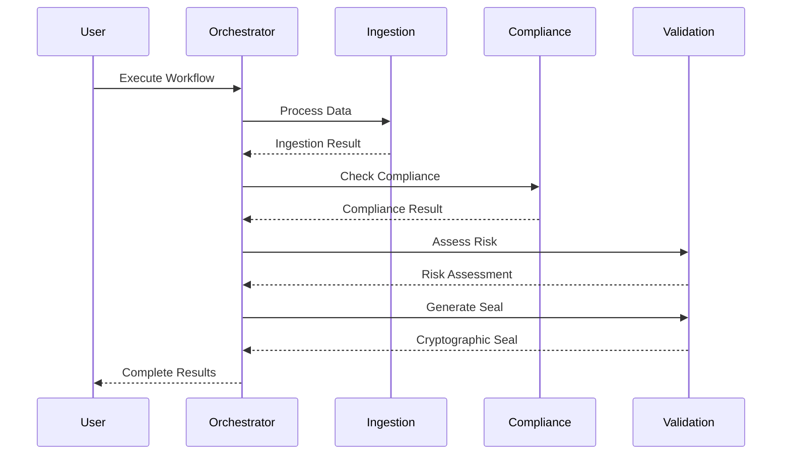
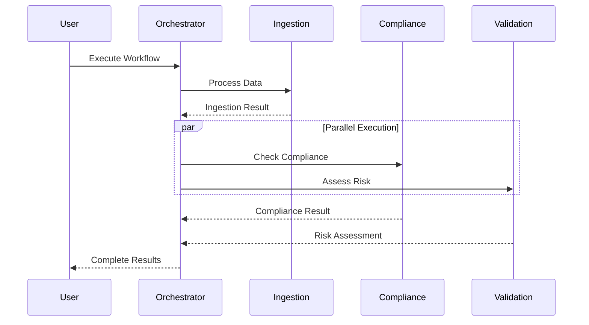

# 🏗️ Trade Intelligence Platform - Architecture Documentation

## System Architecture Deep Dive

This document provides detailed technical specifications for the Trade Intelligence Platform multi-agent system architecture, designed for the IBM AI Builders Challenge.

---

## 🌐 Product Overview

**Trade Intelligence Platform** is an AI-powered solution that automates cross-border trade compliance, document verification, shipment risk analysis, and executive decision support across multiple international trade frameworks.

### Supported Trade Frameworks

**Initial Support:**
- AfCFTA (African Continental Free Trade Area)
- WTO Trade Rules
- Country-specific customs regulations
- General import/export policies

**Future Expansion:**
- USMCA (United States-Mexico-Canada Agreement)
- European Union Customs Union
- ASEAN (Association of Southeast Asian Nations)
- GCC (Gulf Cooperation Council) Customs

---

## 📐 Architecture Layers

### Layer 1: Data Grounding & Sensing

**Purpose**: Real-time data acquisition from multiple sources

**Components**:
- **Live Border Ports Traffic Monitor**
  - Tracks port congestion levels
  - Monitors wait times
  - Captures manifest counts
  
- **Regional Commodity Spot Prices**
  - Real-time price feeds
  - Multi-currency support
  - Market trend analysis

- **Bright Data MCP Gateway**
  - Web scraping infrastructure
  - Proxy management
  - Rate limiting and retry logic

**Data Flow**:
```
External APIs → Bright Data MCP → Data Ingestion Agent
```

**MVP Note**: Uses mock/demo data for all business data. No live API integrations required for hackathon demo.

---

### Layer 2: Control Plane (IBM watsonx Orchestrate)

**Purpose**: Agent lifecycle management and execution coordination

**Components**:

#### 1. Unified API Gateway (`/v1/orchestrate`)
- REST endpoint for agent coordination
- Request routing and load balancing
- Authentication and authorization

#### 2. Agent Registry
- Dynamic agent registration
- Health monitoring
- Status tracking

#### 3. Execution Modes
- **Sequential**: Linear agent pipeline
- **Parallel**: Concurrent execution
- **Conditional**: Smart routing based on results

**Agent Pipeline**:
```
Data Ingestion Agent → Compliance Intelligence Agent → Regulatory Validation Agent
```

---

### Layer 3: Agent Intelligence Layer

#### Agent 1: 🕵️‍♂️ Data Ingestion Agent

**Model**: IBM Granite 20B Multilingual

**Responsibilities**:
- Multilingual data processing (10+ languages)
- Data normalization and structuring
- Entity extraction
- Document parsing
- Trade document verification

**Input Sources**:
- Border port data (mock)
- Commodity price feeds (mock)
- Web scraping results (mock)
- Trade documents (demo PDFs)

**Output Format**:
```json
{
  "source": "border_ports",
  "total_ports": 5,
  "ports": [...],
  "ingestion_timestamp": "2024-01-01T12:00:00Z"
}
```

#### Agent 2: ⚖️ Compliance Intelligence Agent

**Model**: IBM Granite 3.0 8B Instruct

**Responsibilities**:
- Multi-framework trade compliance verification
- Tariff regulation checking
- Rules of origin validation
- Documentation completeness checks
- Regulatory risk assessment

**Supported Frameworks**:
- AfCFTA tariff schedules
- WTO trade rules
- Country-specific regulations
- Extensible to additional frameworks

**Compliance Rules**:
- Framework-specific tariff elimination schedules
- Minimum local content requirements
- Required documentation validation
- Cross-border trade restrictions

**Output Format**:
```json
{
  "check_type": "full_compliance_audit",
  "framework": "AfCFTA",
  "compliance_status": "compliant",
  "overall_score": 98.5,
  "checks": {...},
  "recommendations": [...]
}
```

#### Agent 3: 🛡️ Regulatory Validation Agent

**Model**: IBM Granite Guardian 3.0

**Responsibilities**:
- Transaction risk assessment
- Anomaly detection
- Data integrity verification
- Cryptographic sealing
- Security validation

**Risk Levels**:
- Low: < 30% risk score
- Medium: 30-50% risk score
- High: 50-70% risk score
- Critical: > 70% risk score

**Cryptographic Seal**:
```json
{
  "seal_id": "seal_1234567890",
  "algorithm": "SHA-256/SHA-512",
  "sha256": "abc123...",
  "sha512": "def456...",
  "sealed_at": "2024-01-01T12:00:00Z"
}
```

---

### Layer 4: Presentation Layer

**Component**: Streamlit Cloud Dashboard

**Features**:
- Real-time workflow monitoring
- Agent status visualization
- Performance metrics
- Execution logs
- Manual workflow triggers
- Framework selection
- Document upload interface

**Metrics Tracked**:
- Total workflows executed
- Active workflows
- Average execution time
- Success rate
- Agent health status
- Framework-specific compliance rates

---

## 🔄 Data Flow Patterns

### Sequential Execution Flow



### Parallel Execution Flow



---

## 🔐 Security Architecture

### Authentication & Authorization
- API key-based authentication
- Role-based access control (RBAC)
- JWT token management

### Data Security
- TLS 1.3 for all communications
- AES-256 encryption for sensitive data
- SHA-256/SHA-512 cryptographic sealing

### Audit Trail
- Complete execution history
- Immutable log records
- Cryptographic verification

---

## 📊 Performance Specifications

### Throughput
- **Target**: 60 requests/minute
- **Concurrent**: 10 simultaneous workflows
- **Latency**: < 3 seconds average execution time

### Scalability
- Horizontal scaling via agent replication
- Load balancing across agent instances
- Auto-scaling based on demand

### Reliability
- **Target Uptime**: 99.9%
- **Success Rate**: > 98%
- **Error Recovery**: Automatic retry with exponential backoff

---

## 🔧 Configuration Management

### Environment-Based Configuration
- Development
- Staging
- Production

### Feature Flags
- Parallel execution
- Advanced logging
- Experimental features
- Framework selection

### Model Configuration
```python
{
    "ingestion": {
        "model": "ibm/granite-20b-multilingual",
        "temperature": 0.7,
        "max_tokens": 2048
    },
    "compliance": {
        "model": "ibm/granite-3.0-8b-instruct",
        "temperature": 0.3,
        "max_tokens": 1024
    },
    "validation": {
        "model": "ibm/granite-guardian-3.0-8b",
        "temperature": 0.1,
        "max_tokens": 1024
    }
}
```

---

## 🧪 Testing Strategy

### Unit Tests
- Individual agent functionality
- Data validation
- Error handling

### Integration Tests
- Agent-to-agent communication
- Orchestration workflows
- Mock data integration

### End-to-End Tests
- Complete workflow execution
- Dashboard functionality
- Performance benchmarks

---

## 📈 Monitoring & Observability

### Metrics Collection
- Prometheus for metrics
- Grafana for visualization
- Custom dashboards

### Logging
- Structured logging (JSON)
- Log levels: DEBUG, INFO, WARNING, ERROR
- Centralized log aggregation

### Alerting
- Workflow failures
- Performance degradation
- System health issues

---

## 🚀 Deployment Architecture

### Container Strategy
```
Docker Container
├── Python 3.9+ Runtime
├── Application Code
├── Dependencies
└── Configuration
```

### Orchestration
- Kubernetes for container orchestration
- Helm charts for deployment
- CI/CD via GitHub Actions

### Infrastructure
- Cloud-native deployment (AWS/Azure/GCP)
- Auto-scaling groups
- Load balancers

---

## 📦 MVP Data Strategy

### Mock Data Approach
For the 30-day hackathon MVP, all business data uses realistic mock/demo datasets:

**Mock Data Includes**:
- 100+ sample shipment records
- Fictional exporters and importers
- Demo trade documents (invoices, bills of lading, certificates)
- Sample border port traffic data
- Commodity price feeds
- Compliance check results
- Risk assessment scores

**Benefits**:
- Reliable demo experience
- No external API dependencies
- Fast development cycle
- Easy to replace with real data later

**Real Integration**:
- IBM Granite models via watsonx.ai (only real API)
- All AI capabilities use actual IBM services

---

## 🔄 Future Enhancements

### Phase 2 Features
- [ ] Additional trade framework support (USMCA, EU, ASEAN)
- [ ] Machine learning-based anomaly detection
- [ ] Blockchain integration for trade verification
- [ ] Mobile application
- [ ] Multi-region deployment

### Phase 3 Features
- [ ] Advanced analytics dashboard
- [ ] Predictive compliance modeling
- [ ] Integration with real customs systems
- [ ] Real-time notification system
- [ ] Multi-language UI support

---

## 📚 References

- [IBM watsonx Orchestrate Documentation](https://www.ibm.com/docs/en/watsonx)
- [IBM Granite Models](https://www.ibm.com/granite)
- [AfCFTA Official Documentation](https://au.int/en/cfta)
- [WTO Trade Rules](https://www.wto.org)
- [Bright Data API Documentation](https://docs.brightdata.com)

---

## 🎯 Trade Framework Extensibility

The platform is designed to easily add new trade frameworks:

### Adding a New Framework

1. **Define Framework Rules**
   ```python
   framework_rules = {
       "framework_id": "USMCA",
       "tariff_schedules": {...},
       "rules_of_origin": {...},
       "documentation": [...]
   }
   ```

2. **Update Compliance Agent**
   - Add framework-specific validation logic
   - Configure tariff schedules
   - Define documentation requirements

3. **Update UI**
   - Add framework selection option
   - Display framework-specific metrics
   - Show relevant compliance checks

4. **Test with Mock Data**
   - Create sample transactions
   - Validate compliance logic
   - Verify reporting accuracy

---

**Last Updated**: 2026-06-16  
**Version**: 2.0.0  
**Maintained By**: Trade Intelligence Platform Team  
**Built for**: IBM AI Builders Challenge